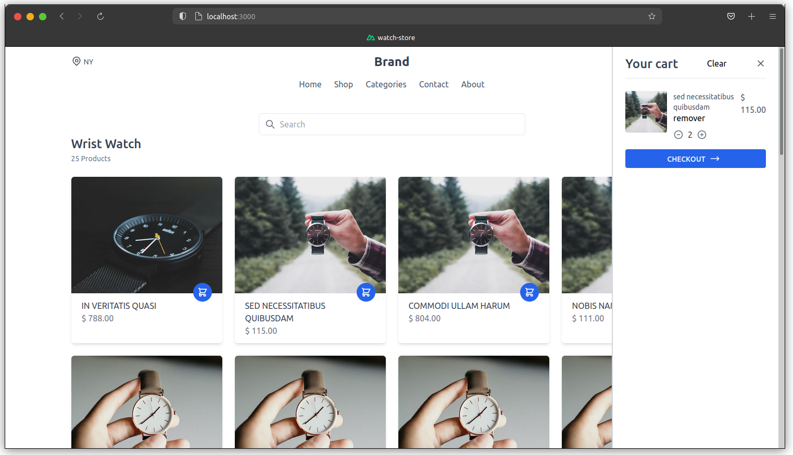

<h1 align="center">Watch Store</h1>

<p align="center">Simple project of an watch store created to understand the concepts of testing with jest and cypress in an vue application during the <a href="https://github.com/vedovelli" target="_blank">@vedovelli</a> course.</p>

<p align="center">
    <a href='https://github.com/EduardoJM/watch-store'></a>
    <a href='https://github.com/EduardoJM/watch-store'></a>
    <a href='https://coveralls.io/github/EduardoJM/watch-store?branch=main'></a>
    <a href='https://github.com/EduardoJM/watch-store/blob/main/LICENSE'></a>
</p>

---

<p align="center">
    
</p>

<p align="center">
    A version of that aplication is hosted into the GitHub Pages with MirageJS serving the API endpoints: <a href="https://eduardojm.github.io/watch-store/" target="_blank">click here to visit</a>.
</p>

---

## How to Run Locally

### 1. Clone the Repository

```sh
https://github.com/EduardoJM/watch-store.git
cd watch-store
```

### 2. Install the dependencies

```sh
yarn
```

### 3. Run the development version

```sh
yarn dev
```

## How to run tests

### With Jest

```sh
yarn test
```

#### In watch mode

```sh
yarn test:watch
```

#### With code coverage

```sh
yarn test:coverage
```

### With Cypress

```sh
yarn test:e2e
```

The `test:e2e` script run the dev application and the cypress, then is not needed to start the application before running the `yarn test:e2e`.

---

## About the CI/CD Workflows

We have two basic workflows for tests:

- **tests.yml**: executes the `yarn test:coverage` on pull request and push to main and send the coverage data to coveralls.
- **e2e-tests.yml**: run the end-to-end tests with **cypress**.

We have, too, a workflow to deploy:

- **deploy.yml**: executes the `yarn generate` and deploy the generated application to GitHub Pages.

And, the last workflow, is an workflow to made automerge of the dependabot pull requests (inspired by the [@sibelius](https://github.com/sibelius)):

- **automerge.yml**: if all verifications of the workflow is parsed, then the dependabot made automerge of the pull request.
